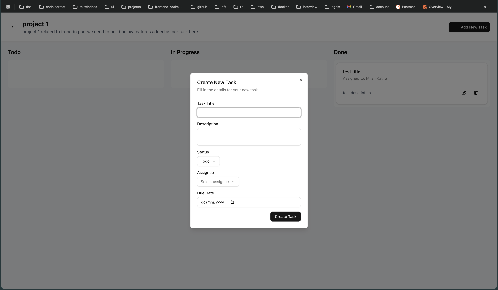
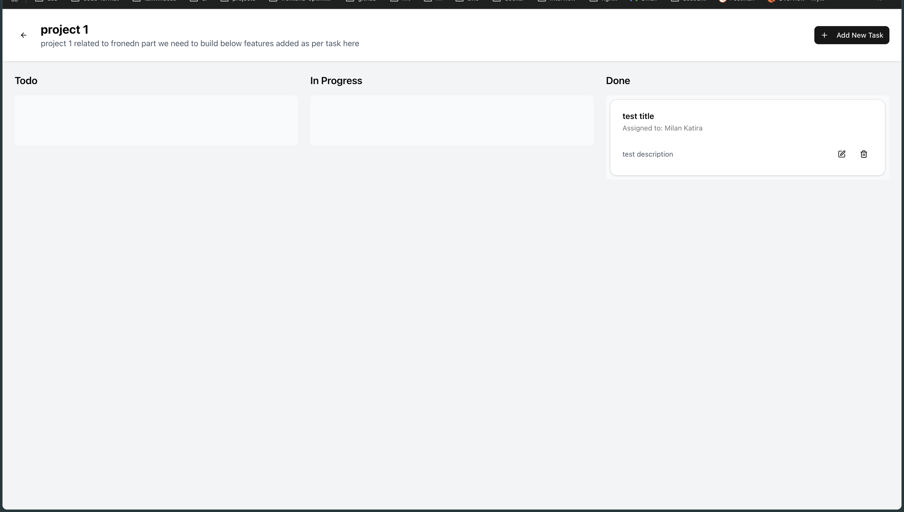
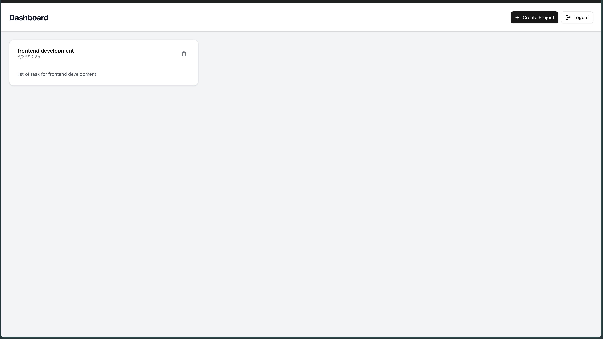
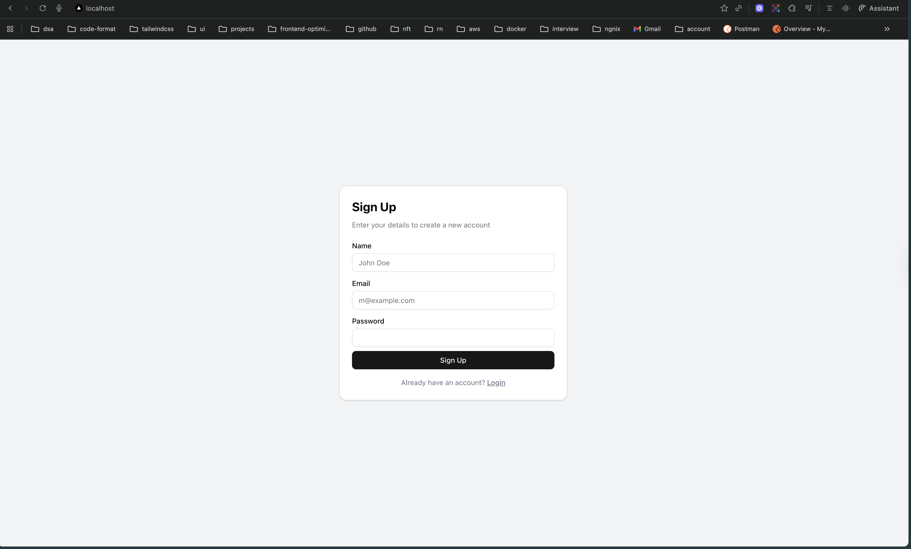
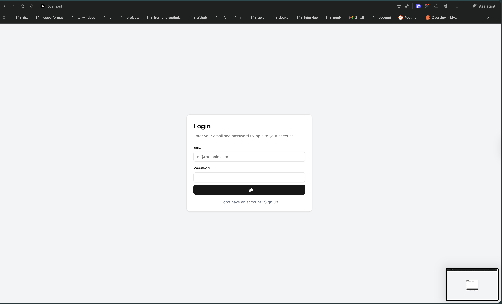
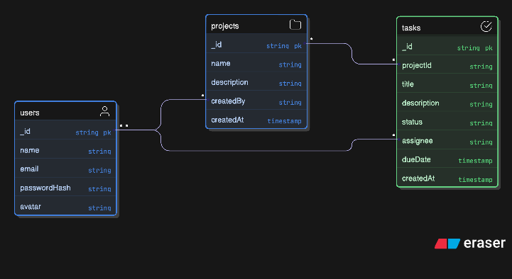

# Project Title

This is a full-stack application with a Node.js/Express/TypeScript backend and a Next.js/React/TypeScript frontend.

## Table of Contents


- [Project Title](#project-title)
  - [Table of Contents](#table-of-contents)
  - [Technologies Used](#technologies-used)
    - [Backend](#backend)
    - [Frontend](#frontend)
  - [Getting Started](#getting-started)
    - [Prerequisites](#prerequisites)
    - [Backend Setup](#backend-setup)
    - [Frontend Setup](#frontend-setup)
  - [API Endpoints](#api-endpoints)
  - [Project Structure](#project-structure)
  - [Screenshots](#screenshots)
  - [E-R Diagram](#e-r-diagram)

## Technologies Used

### Backend
- Node.js
- Express.js
- TypeScript
- (Potentially) Mongoose/MongoDB for database interaction (based on `models` and `db` folders)

### Frontend
- Next.js
- React
- TypeScript
- Tailwind CSS (implied by `postcss.config.mjs` and `globals.css`)

## Getting Started

Follow these instructions to set up and run the project locally.

### Prerequisites

Make sure you have the following installed:
- Node.js (LTS version recommended)
- npm or Yarn

### Backend Setup

1.  Navigate to the `backend` directory:
    ```bash
    cd backend
    ```

2.  Install backend dependencies:
    ```bash
    npm install
    # or yarn install
    ```

3.  Create a `.env` file in the `backend` directory and add your environment variables. A typical `.env` file might look like this:
    ```
    PORT=5000
    MONGO_URI=your_mongodb_connection_string
    JWT_SECRET=your_jwt_secret_key
    ```
    *Replace `your_mongodb_connection_string` with your MongoDB connection URI and `your_jwt_secret_key` with a strong, random string.*

4.  Run the backend server:
    ```bash
    npm run dev
    # or yarn dev
    ```
    The backend server should now be running, typically on `http://localhost:5000` (or the PORT you specified).

### Frontend Setup

1.  Navigate to the `frontend` directory:
    ```bash
    cd frontend
    ```

2.  Install frontend dependencies:
    ```bash
    npm install
    # or yarn install
    ```

3.  Create a `.env.local` file in the `frontend` directory and add your environment variables. A typical `.env.local` file might look like this:
    ```
    NEXT_PUBLIC_BACKEND_URL=http://localhost:5000/api
    ```
    *Adjust the URL if your backend is running on a different address or port.*

4.  Run the frontend development server:
    ```bash
    npm run dev
    # or yarn dev
    ```
    The frontend application should now be accessible at `http://localhost:3000`.

## API Endpoints

The backend provides RESTful API endpoints for user authentication, project management, and task management. Key routes include:
- `/api/auth` (for user registration and login)
- `/api/users` (for user-related operations)
- `/api/projects` (for project-related operations)
- `/api/tasks` (for task-related operations)

Refer to the `backend/src/routes` directory for a detailed list of available endpoints and their functionalities.

## Project Structure

```
.git/
backend/
├───src/
│   ├───controllers/    # Handles request logic
│   ├───db/             # Database connection and setup
│   ├───middleware/     # Express middleware (e.g., authentication)
│   ├───models/         # Mongoose schemas/models
│   └───routes/         # API route definitions
└───...
frontend/
├───public/             # Static assets
├───src/
│   ├───app/            # Next.js app router pages and layouts
│   ├───components/     # Reusable React components
│   └───lib/            # Utility functions and API clients
└───...
```

## Screenshots







## E-R Diagram
